# 一、工程介绍

构建一个带路由功能的HTTP微服务架构，支持`JSON`序列化，支持`MySQL`关系型数据库，支持`JWT`安全认证，支持`Nacos`服务注册与配置管理，支持消息中间件`RocketMQ`，支持`FastDFS`分布式文件存储，支持`Redis`缓存数据库，支持`Excel`报表导入导出。

## 1 目录说明

- `arch-demo`：架构演示模块
- `arch-tests`：单元测试模块
- `lib-dy`：动态库存放目录
- `lib-common`：公用组件静态库模块
- `lib-oatpp`：web服务组件静态库模块
- `lib-mysql`：mysql数据库组件静态模块
- `nacos-register`：`Nacos`批量注册服务模块
- `.gitattributes`：git属性配置文件
- `.gitignore`：git忽略配置文件
- `build.sh`：Linux环境下构建和安装脚本
- `run-xxx.sh`：Linux环境下服务启动脚本
- `CMakeLists.txt`：`Cmake`配置
- `CMakeSettings.json`：VS `Cmake`项目配置文件
- `copy-resources.bat`：快速构建项目模块批处理脚本
- `exclude.txt`：批处理复制排除项配置
- `imgs`：自述文件图片资源目录
- `README.md`：工程自述文件

## 2 静态库目录规范

静态库项目包括如下几个主要的目录结构：

- `include`：存放第三方引入库的`h`或`hpp`文件，存放自己编写的`h`文件，方便使用静态库引用。
- `src`：存放`include`定义`h`的实现`cpp`资源文件。
- `lib64`：用于存放第三方库编译的静态库。
- `pch.h / pch.cpp`：如果需要预编译标头，那么就需要定义。

## 3 动态库目录规范

动态库目录名称为`lib-dy`，里面主要包含程序执行需要的动态库文件，按照如下目录结构存放文件即可。

- `lib64`
  - debug
  - release
  - Linux系统下面用到的动态库

## 4 环境搭建参考

静态库：

https://learn.microsoft.com/zh-cn/cpp/build/walkthrough-creating-and-using-a-static-library-cpp?view=msvc-170

标头：

https://learn.microsoft.com/zh-cn/cpp/build/walkthrough-header-units?view=msvc-170

**Linux：**

- https://learn.microsoft.com/zh-cn/cpp/linux/download-install-and-setup-the-linux-development-workload?view=msvc-170

- ```sh
  # CentOS、龙蜥
  yum -y install openssh-server gcc-c++ gdb cmake make ninja-build rsync zip unzip
  # Ubuntu
  sudo apt-get -y install openssh-server g++ gdb cmake make ninja-build rsync zip unzip
  ```

## 5 Windows平台项目搭建

克隆项目架构后，可以先使用`arch-demo`项目进行测试，用于确认项目架构能否正常工作。

在打开项目之前需要确保你的VS工作负荷支持`Cmake`，工作负荷示意如下图所示：

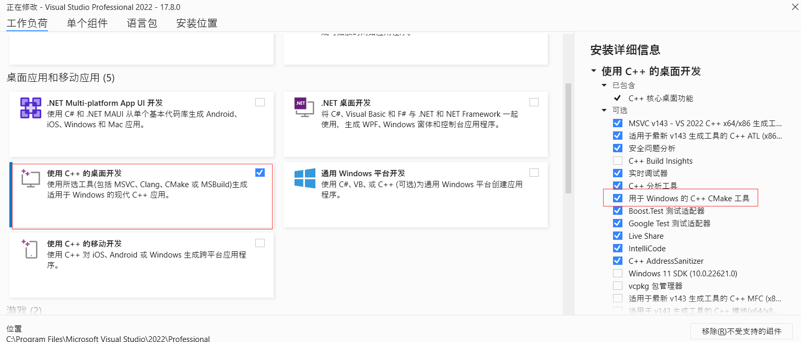

**TIP：** 

- 如果架构能够正常运行，接下来就需要在解决方案中，新增项目来完成你的业务功能。

- 你可以使用`copy-resources.bat`项目快速构建工具创建你项目模块。

### 5.1 配置项目模块

#### 5.1.1 创建项目模块

双击`copy-resources.bat`启动项目快速构建工具，然后输入你的模块名称，示例如下图所示：

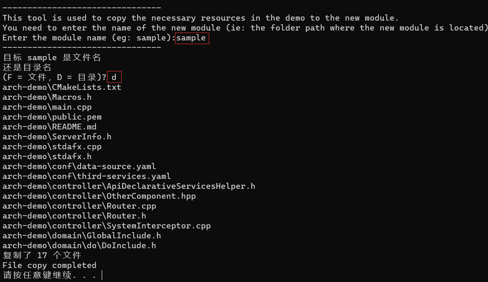

执行成功后你可以看到一个项目模块目录，里面会包含项目骨架代码。

#### 5.1.2 修改项目配置

通过上一个步骤你已经将主要的项目骨架配置好了，接下来只需要做少量的修改就可以完成项目配置。

找到你的新增模块的`CMakeLists.txt`项目配置文件，将项目中的关于`demo项目的配置`去掉以及修改一下项目名即可。

关键配置如下所示：

```cmake
# CMakeList.txt: 【需要修改成你的项目名】 的 CMake 项目，在此处包括源代码并定义
# 项目特定的逻辑。
#
cmake_minimum_required (VERSION 3.8)

# 标记是否是示例架构模块，业务模块需要将此致修改为false
set(IS_ARCH_DEMO false) # 【将该变量值设置为false】

# 设置文件名称
set (appName 【需要修改成你的项目名】)

# 这里省略了一万行配置
```

#### 5.1.3 添加到解决方案中

要将你的项目模块添加到解决方案中非常简单，只需要修改项目根目录下面的`CMakeLists.txt`配置文件即可，在文件末尾追加上你的项目模块即可，关键配置如下所示

```cmake
# 这里省略了一万行配置

# 这是示例模块，后期可以不编译它
add_subdirectory ("arch-demo")
# 在后面添加你的模块
add_subdirectory ("你的模块对应的文件夹名")
```

#### 5.1.4 修改自述文件

每个项目模块都应该有对应的自述文件用来描述该模块的作用，你需要修改你的模块的`README.md`，来描述你的模块，下面是参考描述。

```markdown
# xxx模块

## 简介
这里是模块简介。

## 目录结构说明
> `你的模块文件夹名称`
>
> > `conf` -- Windows平台需要的配置文件
> >
> > `controller` -- `MVC`中Controller实现，用于接收用户请求
> >
> > `service` -- 业务逻辑服务层
> >
> > `dao` -- 数据库访问层
> >
> > `domain`  -- 领域模型实体
> >
> > `CMakeLists.txt` -- `Cmake`跨平台编译配置文件
> >
> > `Macros.h` -- 通用宏定义
> >
> > `ServerInfo.h` -- 服务器信息缓存单例
> >
> > `stdafx.h` -- 预编译标头文件
> >
> > `main.cpp` -- 程序入口
> >
> > `public.pem` -- `RSA`公钥
> >
> > `zh-dict.yaml` -- 中文词典配置

## 各层命名规范

- `Controller/Service/DAO` 层方法命名规约
  - 获取单个对象的方法用 `query/get/select` 做前缀。
  - 获取多个对象的方法用 `query/list/select` 做前缀。
  - 获取统计值的方法用 `count/count/count` 做前缀。
  - 插入的方法用 `add/save/insert` 做前缀。
  - 删除的方法用 `remove/remove/delete` 做前缀。
  - 修改的方法用 `modify/update/update` 做前缀。
  - `Controller`执行逻辑处理方法使用`exec`作前缀。
    - 如接口端点方法名称为`queryByName`，对应的执行方法名则为`execQueryByName`。
  - `API`请求路径命名，前缀（如：功能模块名称）+ 功能名称（多个单词使用-连接），比如下面的示例：
    - `/sys/query-by-name`、`/user/add-user`、`/user/modify-password`。
- 领域模型命名规约
  - DO：`xxxDO`，`xxx` 即为数据表名。
  - DTO：`xxxDTO`，`xxx` 为业务领域相关的名称。
  - Query：`xxxQuery`，`xxx`为业务领域相关的名称。
  - VO：`xxxVO`，`xxx` 一般为网页名称。
  - `POJO` 是 `DO/DTO/BO/VO/Query` 的统称，禁止命名成 `xxxPOJO`。
```

#### 5.1.5 修改中文词典编码

由于中文字典在构建的时候没有指定编码，为了避免中文乱码，所有需要修改其编码格式为`utf8`编码，修改方式有很多，下面演示使用VS高级保存选项功能来设置编码。

首先在你的项目模块中找到`zh-dict.yaml`文件，然后打开它，比如我打开后的效果如下图所示

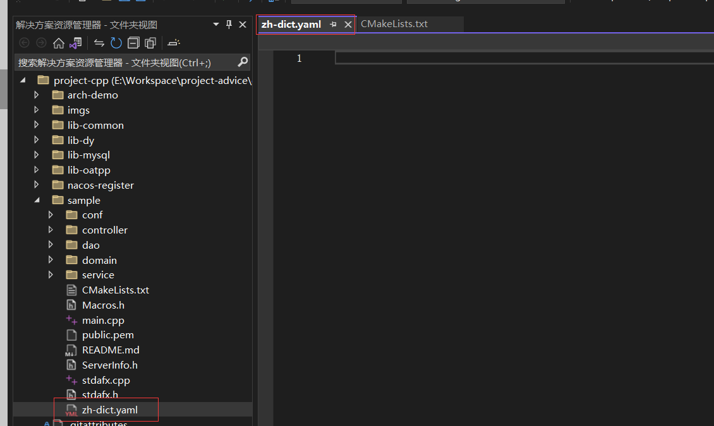

然后找到你的**高级保存选项**菜单，点击的后，选择如下图所示的编码

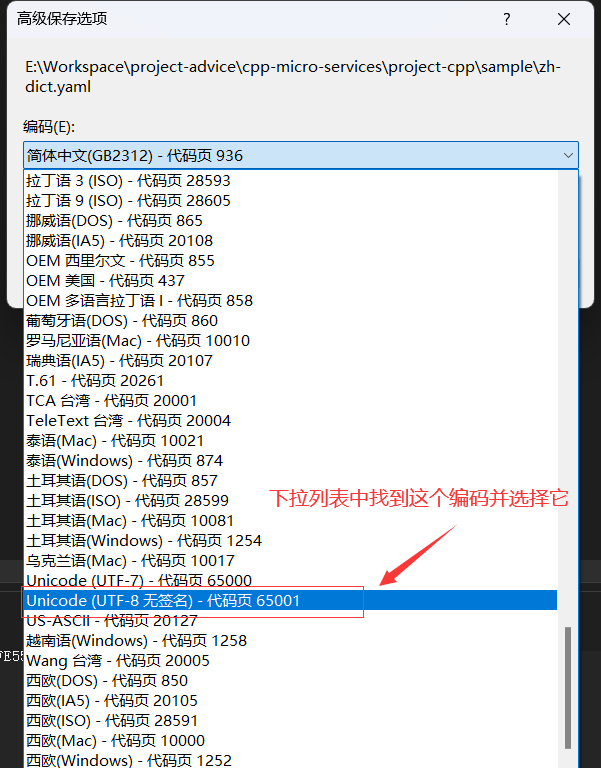

修改成功后，再点开**高级保存选项**菜单后，看到的编码格式为

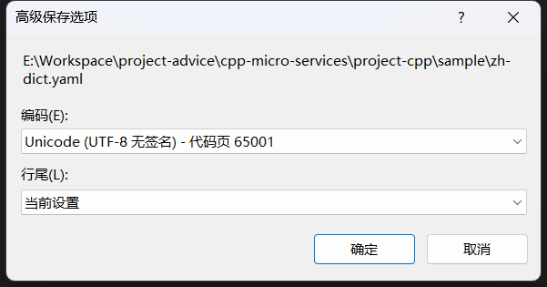

#### 5.1.6 启动测试

通过前面的步骤，你的新项目模块已经差不多配置好了，接下来可以启动测试，启动的时候选择新模块为启动项目，操作如下图所示。

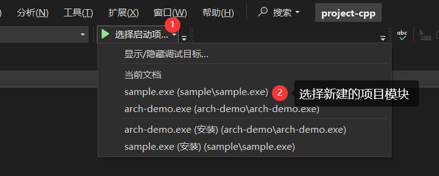

选择完启动项后，点击项目启动，启动后可以看到如下图所示的效果，表示项目设置已经OK了

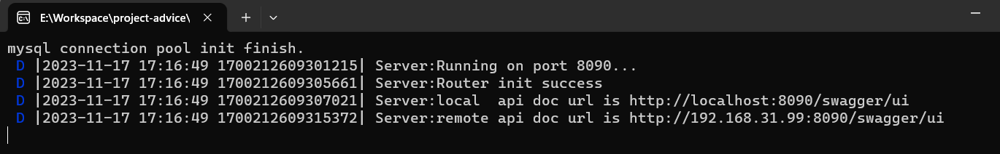

***提示：***可能启动会失败，此时应该是你的数据库地址、端口、账号、密码等等设置不匹配，修改`main.cpp`中对应代码或设置启动参数。

以上是构建新功能模块的基本操作步骤，是不是很简单就完成了~

#### 5.1.7 预编译头

在Windows环境下为加快程序编译效率，会启用预编译标头，下面是标头文件的定义，通过项目构建工具，会自动集成到你的模块中的。

```c++
// stdafx.h: 这是预编译标头文件。
// 下方列出的文件仅编译一次，提高了将来生成的生成性能。
// 这还将影响 IntelliSense 性能，包括代码完成和许多代码浏览功能。
// 但是，如果此处列出的文件中的任何一个在生成之间有更新，它们全部都将被重新编译。
// 请勿在此处添加要频繁更新的文件，这将使得性能优势无效。

#ifndef STDAFX_H
#define STDAFX_H

#ifndef LINUX

// 解决std::byte类型重定义
#define _HAS_STD_BYTE 0
// 添加要在此处预编译的标头
#include "OatppMacros.h"
#include "jwt/jwt.hpp"
#include "mysql/jdbc.h"
#include "SqlSession.h"
#include "yaml-cpp/yaml.h"
#include "sw/redis++/redis++.h"

#endif // !LINUX

#endif //STDAFX_H
```

下面是`stdafx.cpp`

```c++
// stdafx.cpp: 与预编译标头对应的源文件

#include "stdafx.h"

// 当使用预编译的头时，需要使用此源文件，编译才能成功。
```

**注意：你后面添加的每个`cpp`文件、`cpp`文件、`cpp`文件，导入的第一个头文件必须是标头文件`stdafx.h`，可以看项目骨架代码中的`cpp`文件中第一个导入的头文件是怎么写的。**

### 5.2 关键代码

#### 5.2.1 程序入口

在`main.cpp`中可以使用下列代码来启动服务器。

```c++
#include "stdafx.h"
#include "HttpServer.h"
#include "DbInit.h"

int main() {
    //初始数据库连接
    DbInit::initDbPool(
        DBConfig("root", "123456", "test", "192.168.220.128", 3306, 5));
    // 启动HTTP服务器
    HttpServer::startServer("8090",
        [=](Endpoints* doc, HttpRouter* router) {
            //设置路由，可以参考Router的实现
        });
    //释放数据库连接
    DbInit::releasePool();
    return 0;
}
```

#### 5.2.2 实现拦截器

在`lib-oatpp` 模块声明的拦截器（`SystemInterceptor.h`）需要在你的模块中定义。

```c++
#include "stdafx.h"
#include "SystemInterceptor.h"
using namespace oatpp::web::protocol::http;
using namespace oatpp::web::protocol::http::outgoing;
// 实现跨域请求拦截
std::shared_ptr<oatpp::web::server::interceptor::RequestInterceptor::OutgoingResponse> CrosRequestInterceptor::intercept(const std::shared_ptr<IncomingRequest>& request)
{
    return nullptr;
}
// 实现跨域响应拦截
std::shared_ptr<oatpp::web::server::interceptor::ResponseInterceptor::OutgoingResponse> CrosResponseInterceptor::intercept(const std::shared_ptr<IncomingRequest>& request, const std::shared_ptr<OutgoingResponse>& response)
{
    return response;
}
// 凭证检测拦截器构造初始化一些内容
CheckRequestInterceptor::CheckRequestInterceptor(const std::shared_ptr<oatpp::data::mapping::ObjectMapper>& objectMapper)
{
}
// 实现凭证检测拦截处理逻辑
std::shared_ptr<oatpp::web::server::interceptor::RequestInterceptor::OutgoingResponse> CheckRequestInterceptor::intercept(const std::shared_ptr<IncomingRequest>& request)
{
    return nullptr;
}
```

***TIP:完整的拦截器定义可以参考demo中实现，其中实现了凭证验证与跨域处理功能，可以直接复用。***

#### 5.2.3 使用启动参数

定义一个服务器信息类，用于存储服务器信息，参考代码如下

```cpp
class ServerInfo
{
private:
    // 成员初始化
    void init() {
        this->dbPort = 3306;
        this->dbMax = 25;
        // 加载中文词典
        zhDictNode = YAML::LoadFile("zh-dict.yaml");
    }
    // 定义单例
    DECLARE_INSTANCE(ServerInfo);
    // 服务器端口
    CC_SYNTHESIZE(std::string, serverPort, ServerPort);
    // Nacos配置参数
    CC_SYNTHESIZE(std::string, nacosAddr, NacosAddr);
    CC_SYNTHESIZE(std::string, nacosNs, NacosNs);
    CC_SYNTHESIZE(std::string, regIp, RegIp);
    CC_SYNTHESIZE(std::string, serviceName, ServiceName);
    // 数据库连接信息
    CC_SYNTHESIZE(std::string, dbUsername, DbUsername);
    CC_SYNTHESIZE(std::string, dbPassword, DbPassword);
    CC_SYNTHESIZE(std::string, dbName, DbName);
    CC_SYNTHESIZE(std::string, dbHost, DbHost);
    CC_SYNTHESIZE(int, dbPort, DbPort);
    CC_SYNTHESIZE(int, dbMax, DbMax);
    // 定义一个中文字典缓存
    CC_SYNTHESIZE_CR_GET(YAML::Node, zhDictNode, ZhDictNode);
};
```

通过启动参数设定服务器，方便部署服务器。

```c++
#include "stdafx.h"
#include "StringUtil.h"
#include "ServerInfo.h"
#include "HttpServer.h"
#include "controller/Router.h"
#include "controller/OtherComponent.hpp"
#include "DbInit.h"

/**
 * 服务器参数解析
 * 注意：
 * 参数中数据需要满足一定的格式，如：sp=8090、sn=feign-cpp-sample
 * 前缀与真实值之间使用=分隔
 */
void parseServerArgs(int argc, char* argv[]) {
    // 服务器端口
    std::string serverPort = "8090";
    // 数据库连接信息
    std::string dbUsername = "";
    std::string dbPassword = "";
    std::string dbName = "";
    std::string dbHost = "";
    int dbPort = -1;
    int dbMax = -1;

    // 开始解析
    int currIndex = 1;
    int setDbParamNum = 0;
    while (currIndex < argc)
    {
        // 拆分字符串
        auto args = StringUtil::split(argv[currIndex], "=");
        // 判断参数是否合法
        if (args.size() != 2)
        {
            cout << "arg: " << argv[currIndex] << ", format error." << endl;
            exit(1);
        }

        // 根据参数前缀对不同属性赋值
        std::string prefix = args[0];
        std::string val = args[1];
        if (prefix == "sp") serverPort = val;
        else if (prefix == "du")
        {
            setDbParamNum++;
            dbUsername = val;
        }
        else if (prefix == "dp")
        {
            setDbParamNum++;
            dbPassword = val;
        }
        else if (prefix == "dn")
        {
            setDbParamNum++;
            dbName = val;
        }
        else if (prefix == "dh")
        {
            setDbParamNum++;
            dbHost = val;
        }
        else if (prefix == "dP")
        {
            setDbParamNum++;
            dbPort = atoi(val.c_str());
        }
        else if (prefix == "dm") dbMax = atoi(val.c_str());
        // 更新索引
        currIndex++;
    }

    // 从配置中获取数据库配置
    if (setDbParamNum < 5)
    {
        // 获取配置文件中的数据库配置
        YAML::Node node = YAML::LoadFile("./conf/data-source.yaml");
        // 解析配置信息
        YamlHelper yaml;
        std::string dbUrl = yaml.getString(&node, "spring.datasource.url");
        if (dbUrl != "")
        {
            // 解析数据库连接字符串
            yaml.parseDbConnUrl(dbUrl, &dbHost, &dbPort, &dbName);
            // 获取数据库用户名和密码
            dbUsername = dbUsername == "" ? yaml.getString(&node, "spring.datasource.username") : dbUsername;
            dbPassword = dbPassword == "" ? yaml.getString(&node, "spring.datasource.password") : dbPassword;
            dbMax = dbMax == -1 ? atoi(yaml.getString(&node, "spring.datasource.druid.max-active").c_str()) : dbMax;
        }
    }

    // 记录服务器配置到内存中方便使用
    ServerInfo::getInstance().setServerPort(serverPort);
    ServerInfo::getInstance().setDbUsername(dbUsername);
    ServerInfo::getInstance().setDbPassword(dbPassword);
    ServerInfo::getInstance().setDbName(dbName);
    ServerInfo::getInstance().setDbHost(dbHost);
    ServerInfo::getInstance().setDbPort(dbPort);
    ServerInfo::getInstance().setDbMax(dbMax);
}

int main(int argc, char* argv[]) {
    // 服务器参数初始化
    parseServerArgs(argc, argv);
    // 初始数据库连接
    DbInit::initDbPool(DBConfig(
        ServerInfo::getInstance().getDbUsername(), 
        ServerInfo::getInstance().getDbPassword(), 
        ServerInfo::getInstance().getDbName(),
        ServerInfo::getInstance().getDbHost(),
        ServerInfo::getInstance().getDbPort(), 
        ServerInfo::getInstance().getDbMax()));
    // 启动HTTP服务器
    HttpServer::startServer(ServerInfo::getInstance().getServerPort(),
        [=](Endpoints* doc, HttpRouter* router) {
            Router(doc, router).initRouter();
        },
        [](std::shared_ptr<AbstractComponentReg>* o) {
            *o = std::make_shared<OtherComponent>();
        });
    // 释放数据库连接
    DbInit::releasePool();
    return 0;
}
```

所有启动参数说明：

```sh
"na: nacos server host and port. example na=39.99.114.126:8848"
"ns: nacos server namespace. example ns=1653f775-4782-46ad-9cd2-b60155a574c6"
"ip: register ip. example ip=192.168.220.128"
"sn: register service name. example sn=feign-cpp-sample"
"sp: server port. example sp=8090"
"du: mysql database username. example du=root"
"dp: mysql database password. example dp=123456"
"dn: mysql database dbname. example dn=test"
"dh: mysql database host. example dh=192.168.220.128"
"dP: mysql database port. example dP=3306"
"dm: mysql database pool maxsize. example dm=25"
```

***注意：如果不在启动参中传入 `ip` 和 `sn`，服务器启动后就不会注册到 `Nacos` 注册中心，具体看后面的`Nacos`部分***

#### 5.2.4 `Cmake`设置启动参

首先选择启动项

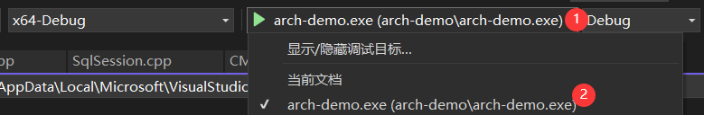

打开启动项配置设置

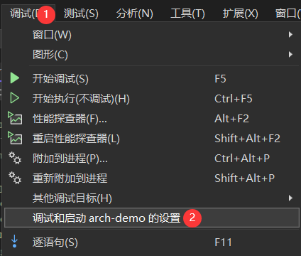

在`lunch.vs.json`中加入你的启动参数配置，如

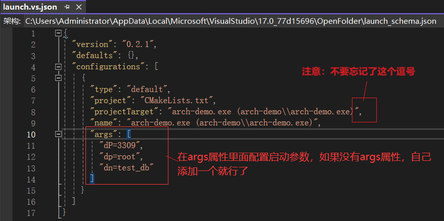

## 6 Linux平台项目搭建

### 6.1 参考链接

#### 6.1.1 `VS CMake`

VS中使用`CMake`参考下面的链接：

https://learn.microsoft.com/zh-cn/cpp/build/cmake-projects-in-visual-studio?view=msvc-170

除了完成 **小节4** 中Linux配置外，为了保证在编译时正常链接程序所需要的库，需要补充安装下列软件包：

```sh
# CentOS、龙蜥
yum -y install openssl-devel libcurl-devel libuuid-devel
# Ubuntu
sudo apt-get -y install openssl libssl-dev libcurl4-openssl-dev uuid-dev
```

#### 6.1.2 `openssl`版本升级

当你启动编译后的可执行文件出现下面的错误，出现这个问题一般是在`CentOS7`上面

```sh
./arch-demo: error while loading shared libraries: libssl.so.1.1: cannot open shared object file: No such file or directory
```

可以参考这个链接进行修复：https://blog.csdn.net/estelle_belle/article/details/111181037

### 6.2 编译配置

#### 6.2.1 项目模块

因为`Cmke`本身支持跨平台编译，而且我提供的`CMakeLists.txt`已经做了跨平台编译处理，所以一般不需要大家做特殊配置，详细配置见你对应业务模块下面的配置文件。

#### 6.2.2 全局配置

除此之外，还需要修改解决方案中的`CMakeLists.txt`，包含你的项目模块目录，详细配置见根目录下面的配置文件。

#### 6.2.3 `VS Cmake`配置参考

需要忽略不需要复制到Linux服务器的文件，详细配置见`CMakeSettings.json`。

### 6.3 启动与停止服务

前台启动指令参考

```sh
./arch-demo sp=8091 du=root ...
# 其中...表示其它启动参数配置，根据你的需要增加即可
```

后台启动指令参考

```sh
nohup ./arch-demo sp=8091 du=root ... >logs.log 2>&1 &
# 其中...表示其它启动参数配置，根据你的需要增加即可
```

停止服务参考指令

```sh
curl http://ip:port/system-kill/密码
# 如: curl http://127.0.0.1:8091/system-kill/01star
```

**TIP**：

*启动如果提示找不到相应的动态库，请将可执行文件同级目录下面的 `lib64` 目录下面的所有 `.so` 文件上传到目标服务器的 `/usr/lib64` 目录下面。*

使用`make install`指令安装后的可执行文件，可以使用shell脚本启动服务，下面是使用示例。

```sh
# 前台启动
./run-front.sh arch-demo sp=8090 du=root ...
# 后台启动
./run-back.sh arch-demo sp=8090 du=root ...
```

### 6.4 支持`Nacos`服务注册与配置获取

***提示：调试的时候需要在cmake启动参数加入na和ns启动参数***

#### 6.4.1 编译配置

```cmake
# 保证你的编译配置中包含有nacos-cli和yaml-cpp
target_link_libraries (${appName} nacos-cli yaml-cpp )
```

#### 6.4.2 程序入口修改

```cpp
#include "stdafx.h"
#include "StringUtil.h"
#include "ServerInfo.h"
#include "HttpServer.h"
#include "controller/Router.h"
#include "controller/OtherComponent.hpp"
#include "DbInit.h"

#ifdef LINUX
#include "NacosClient.h"
#endif

/**
 * 服务器参数解析
 * 注意：
 * 参数中数据需要满足一定的格式，如：sp=8090、sn=feign-cpp-sample
 * 前缀与真实值之间使用=分隔
 */
void parseServerArgs(int argc, char* argv[]) {
    // 服务器端口
    std::string serverPort = "8090";
    // 数据库连接信息
    std::string dbUsername = "";
    std::string dbPassword = "";
    std::string dbName = "";
    std::string dbHost = "";
    int dbPort = -1;
    int dbMax = -1;
#ifdef LINUX
    // Nacos配置参数
    std::string nacosAddr = "";
    std::string nacosNs = "";
    std::string serviceName = "";
    std::string regIp = "";
#endif

    // 开始解析
    int currIndex = 1;
    int setDbParamNum = 0;
    while (currIndex < argc)
    {
        // 拆分字符串
        auto args = StringUtil::split(argv[currIndex], "=");
        // 判断参数是否合法
        if (args.size() != 2)
        {
            cout << "arg: " << argv[currIndex] << ", format error." << endl;
            exit(1);
        }

        // 根据参数前缀对不同属性赋值
        std::string prefix = args[0];
        std::string val = args[1];
        if (prefix == "sp") serverPort = val;
        else if (prefix == "du")
        {
            setDbParamNum++;
            dbUsername = val;
        }
        else if (prefix == "dp")
        {
            setDbParamNum++;
            dbPassword = val;
        }
        else if (prefix == "dn")
        {
            setDbParamNum++;
            dbName = val;
        }
        else if (prefix == "dh")
        {
            setDbParamNum++;
            dbHost = val;
        }
        else if (prefix == "dP")
        {
            setDbParamNum++;
            dbPort = atoi(val.c_str());
        }
        else if (prefix == "dm") dbMax = atoi(val.c_str());
#ifdef LINUX
        else if (prefix == "na") nacosAddr = val;
        else if (prefix == "ns") nacosNs = val;
        else if (prefix == "sn") serviceName = val;
        else if (prefix == "ip") regIp = val;
#endif
        // 更新索引
        currIndex++;
    }

    // 从配置中获取数据库配置
    if (setDbParamNum < 5)
    {
#ifdef LINUX
        // 获取Nacos中的数据库配置
        NacosClient nacosClient(nacosAddr, nacosNs);
        YAML::Node node = nacosClient.getConfig("data-source.yaml");
#else
        // 获取配置文件中的数据库配置
        YAML::Node node = YAML::LoadFile("./conf/data-source.yaml");
#endif
        // 解析配置信息
        YamlHelper yaml;
        std::string dbUrl = yaml.getString(&node, "spring.datasource.url");
        if (dbUrl != "")
        {
            // 解析数据库连接字符串
            yaml.parseDbConnUrl(dbUrl, &dbHost, &dbPort, &dbName);
            // 获取数据库用户名和密码
            dbUsername = dbUsername == "" ? yaml.getString(&node, "spring.datasource.username") : dbUsername;
            dbPassword = dbPassword == "" ? yaml.getString(&node, "spring.datasource.password") : dbPassword;
            dbMax = dbMax == -1 ? atoi(yaml.getString(&node, "spring.datasource.druid.max-active").c_str()) : dbMax;
        }
    }

    // 记录服务器配置到内存中方便使用
    ServerInfo::getInstance().setServerPort(serverPort);
    ServerInfo::getInstance().setDbUsername(dbUsername);
    ServerInfo::getInstance().setDbPassword(dbPassword);
    ServerInfo::getInstance().setDbName(dbName);
    ServerInfo::getInstance().setDbHost(dbHost);
    ServerInfo::getInstance().setDbPort(dbPort);
    ServerInfo::getInstance().setDbMax(dbMax);
#ifdef LINUX
    ServerInfo::getInstance().setNacosAddr(nacosAddr);
    ServerInfo::getInstance().setNacosNs(nacosNs);
    ServerInfo::getInstance().setRegIp(regIp);
    ServerInfo::getInstance().setServiceName(serviceName);
#endif
}

int main(int argc, char* argv[]) {
    // 服务器参数初始化
    parseServerArgs(argc, argv);

#ifndef _RELEASE_DOC_
    // 初始数据库连接
    bool initConnPool = DbInit::initDbPool(DBConfig(
        ServerInfo::getInstance().getDbUsername(),
        ServerInfo::getInstance().getDbPassword(),
        ServerInfo::getInstance().getDbName(),
        ServerInfo::getInstance().getDbHost(),
        ServerInfo::getInstance().getDbPort(),
        ServerInfo::getInstance().getDbMax()));
    if (!initConnPool) return -1;
#endif

#ifdef LINUX
    // 创建Nacos客户端对象
    NacosClient nacosClient(
        ServerInfo::getInstance().getNacosAddr(),
        ServerInfo::getInstance().getNacosNs());

    // 注册服务
    if (!ServerInfo::getInstance().getServiceName().empty() && !ServerInfo::getInstance().getRegIp().empty())
    {
        nacosClient.registerInstance(
            ServerInfo::getInstance().getRegIp(),
            atoi(ServerInfo::getInstance().getServerPort().c_str()),
            ServerInfo::getInstance().getServiceName());
    }
#endif

    // 启动HTTP服务器
    HttpServer::startServer(ServerInfo::getInstance().getServerPort(),
        [=](Endpoints* doc, HttpRouter* router) {
            Router(doc, router).initRouter();
        },
        [](std::shared_ptr<AbstractComponentReg>* o) {
            *o = std::make_shared<OtherComponent>();
        });

#ifndef _RELEASE_DOC_
    // 释放数据库连接
    DbInit::releasePool();
#endif

#ifdef LINUX
    // 反注册服务
    if (!ServerInfo::getInstance().getServiceName().empty() && !ServerInfo::getInstance().getRegIp().empty())
    {
        nacosClient.deregisterInstance(
            ServerInfo::getInstance().getRegIp(),
            atoi(ServerInfo::getInstance().getServerPort().c_str()),
            ServerInfo::getInstance().getServiceName());
    }
#endif
    return 0;
}
```

# 二、分层领域模型规约

领域模型本身有没固定的使用限制，但是在一套项目架构体系中需要有统一的规范。

领域对象描述：

- DO（Data Object）：此对象与数据库表结构一一对应，通过 `DAO` 层向上传输数据源对象。
- `DTO`（Data Transfer Object）：数据传输对象，Service 或 Manager 向外传输的对象。 
- BO（Business Object）：业务对象，可以由 Service 层输出的封装业务逻辑的对象。
- Query：数据查询对象，各层接收上层的查询请求。注意超过2个参数的查询封装，禁止使用Map类来传输。
- `VO`（View Object）：显示层对象，通常是 Web 向模板渲染引擎层传输的对象。

各层之间的关系如下图所示，里面包含了领域模型的传递过程。

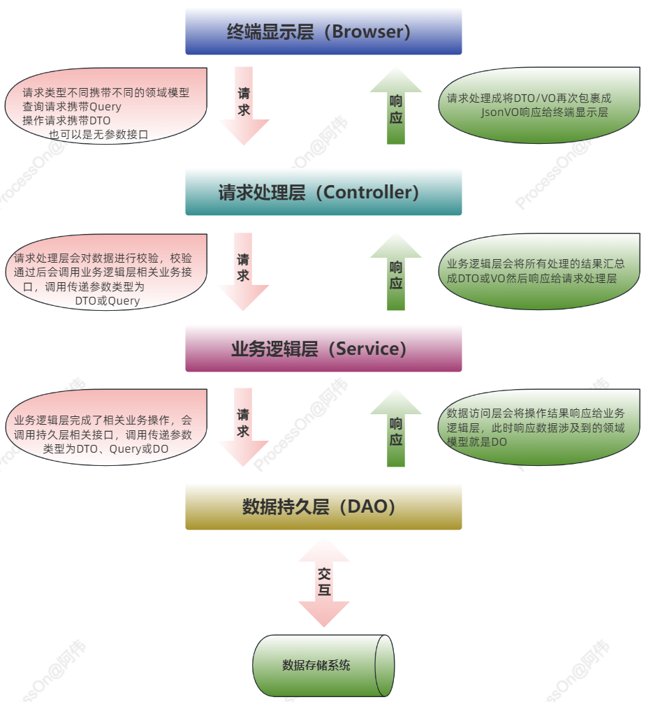
